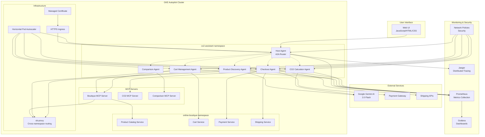

# CO2-Aware Shopping Assistant - Architecture Diagram

## System Architecture Overview



## Technology Stack

### Core Technologies
- **Google Kubernetes Engine (GKE) Autopilot**: Container orchestration and management
- **Model Context Protocol (MCP)**: Integration with Google's AI services
- **Agent-to-Agent (A2A) Communication**: Inter-agent messaging and coordination
- **Python FastAPI**: Backend API framework
- **JavaScript/HTML/CSS**: Frontend user interface
- **gRPC**: High-performance inter-service communication

### Google Cloud Services
- **GKE Autopilot**: Managed Kubernetes cluster
- **Cloud Build**: CI/CD pipeline
- **Container Registry**: Docker image storage
- **Load Balancing**: Traffic distribution and SSL termination
- **Managed Certificates**: Automatic SSL certificate management

### External Integrations
- **Online Boutique**: Product catalog and inventory management
- **Gemini AI**: Intelligent product recommendations and explanations
- **Payment Processing**: Secure checkout functionality
- **Shipping Services**: Real-time shipping calculations

## Communication Flow

### 1. User Request Processing
```
User Input → Web UI → Host Agent (A2A Router) → Specialized Agent
```

### 2. Agent-to-Agent Communication (A2A)
```
Host Agent ↔ Product Discovery Agent
Host Agent ↔ Cart Management Agent
Host Agent ↔ CO2 Calculator Agent
Host Agent ↔ Checkout Agent
Host Agent ↔ Comparison Agent
```

### 3. MCP Server Integration
```
Agent → MCP Server → External Service (Online Boutique)
Agent → MCP Server → AI Service (Gemini)
Agent → MCP Server → Data Service (CO2 Calculations)
```

### 4. Cross-Namespace Communication
```
co2-assistant namespace → ob-proxy → online-boutique namespace
```

## Key Features

### Multi-Agent Architecture
- **Host Agent**: Intelligent request routing and intent analysis
- **Product Discovery Agent**: Specialized product search and recommendations
- **Cart Management Agent**: Shopping cart operations and management
- **CO2 Calculator Agent**: Environmental impact calculations
- **Checkout Agent**: Payment processing and order management
- **Comparison Agent**: Product comparison and analysis

### Environmental Intelligence
- **Real-time CO2 calculations** with shipping optimization
- **Eco-friendly recommendations** based on carbon footprint
- **Sustainable shipping options** with impact visualization
- **Carbon offset integration** and tracking

### Production-Grade Features
- **Auto-scaling** with Horizontal Pod Autoscaler
- **Circuit breaker patterns** for resilience
- **Comprehensive monitoring** with Prometheus + Grafana
- **Security hardening** with pod and network policies
- **Cost optimization** with 50% resource reduction

## Data Flow

### Product Search Flow
1. User searches for products
2. Host Agent routes to Product Discovery Agent
3. Product Discovery Agent queries Boutique MCP Server
4. Boutique MCP Server communicates with Online Boutique
5. CO2 Calculator Agent calculates environmental impact
6. Results returned with CO2 impact and eco-scores

### Cart Management Flow
1. User adds items to cart
2. Host Agent routes to Cart Management Agent
3. Cart Management Agent updates cart state
4. CO2 Calculator Agent calculates cart environmental impact
5. Cart Management Agent provides eco-friendly alternatives
6. Updated cart with environmental metrics returned

### Checkout Flow
1. User initiates checkout
2. Host Agent routes to Checkout Agent
3. Checkout Agent processes payment
4. CO2 Calculator Agent calculates shipping impact
5. Checkout Agent selects optimal shipping method
6. Order confirmation with environmental summary

## Security & Monitoring

### Security Features
- **Network Policies**: Namespace isolation and traffic control
- **Pod Security Policies**: Non-root containers and capability restrictions
- **TLS Encryption**: Secure communication between services
- **Kubernetes Secrets**: Secure storage of sensitive data

### Monitoring & Observability
- **Prometheus**: Metrics collection and alerting
- **Grafana**: Real-time dashboards and visualization
- **Jaeger**: Distributed tracing for debugging
- **Health Checks**: Automated service health monitoring
- **SLO Monitoring**: Service level objective tracking

## Cost Optimization

### Resource Management
- **Environment-specific configurations**: Dev vs Prod resource allocation
- **Horizontal Pod Autoscaler**: Dynamic scaling based on load
- **Resource right-sizing**: Optimized CPU and memory requests
- **Cost monitoring**: Real-time cost tracking and optimization

### Performance Optimization
- **Connection pooling**: Efficient database connections
- **Caching strategies**: Reduced external API calls
- **Circuit breakers**: Fault tolerance and resilience
- **Load balancing**: Optimal traffic distribution
